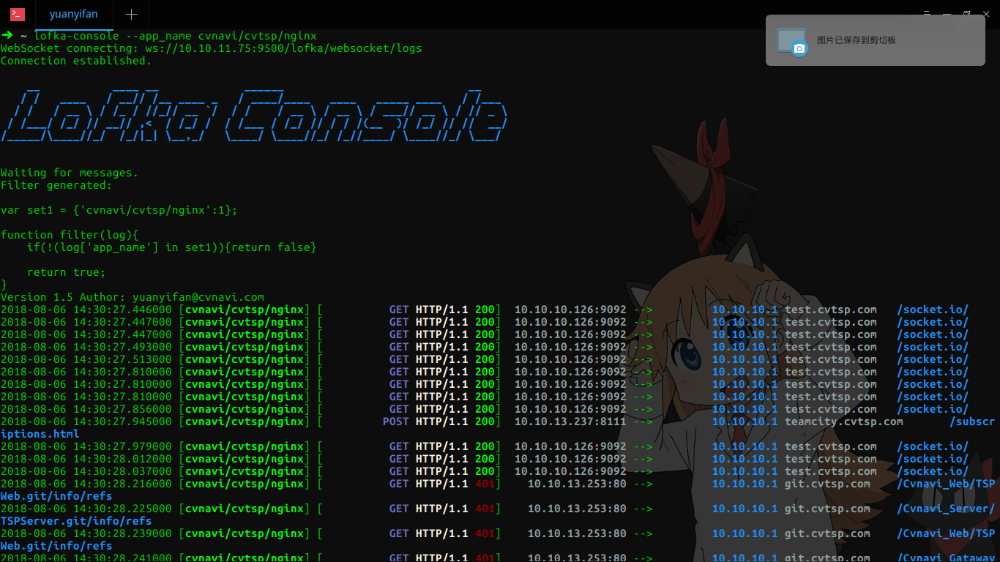
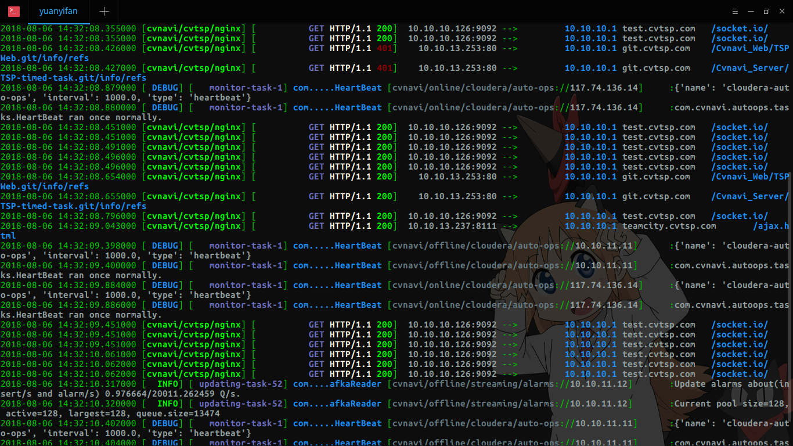

# Lofka日志收集系统

**请注意，本项目在Apache 2.0 的基础上增加了 996-ICU 协议，使用的时候请注意遵守相关法律法规**

## 简介

你还在这样看日志吗？

```bash
tail -f /var/log/nginx/access.log|grep xxxxxFUCKxxxx
```
日志输出多了看不到关键点，输出等级高了看不到系列？

多个服务器的日志是否看起来很痛苦？常常使用TMUX开多个小窗口排查问题在哪里，眼睛都看不过来。

快试试 Lofka，日志集中收集管理，自动统计，动态配置逻辑，可联动报警，可路由转发，方便、灵活、还可靠～

## 程序特点

- 日志集中化收集和持久化
- 可拓展的持久化方式
- 不影响现有日志收集系统，可平滑切换
- 统一的日志控制台（可在终端、网页上查看）
- 多语言支持
    - Java(Log4j 1.x/2.x && LogBack)
    - Python(支持原生Logger)
    - .Net(Log4Net)
    - 更多等你来支持……
- 分布式日志收集
    - 可水平拓展
    - 可路由（日志转发）

# Docker Compose Quick Start

```yaml
version: "2.1"
services:
  lofka:
    image: tsingjyujing/lofka-lite
    restart: "always"
    ports:
      - "9500:9500"
    depends_on:
      - mongo

  mongo:
    image: mongo:4-xenial
    restart: "always"
    healthcheck:
      test: "echo 'db.stats().ok' | mongo 127.0.0.1:27017/leanote --quiet"
    volumes:
      - "~/app/lofka/data:/data/db"
    mem_limit: 800M
```

# TODO

- Web查询历史日志
- Go/C++/Rust 等语言日志收集
- 智能异常发现
    - 日志段正常、异常标记工具
    - 日志数据训练工具
    - 日志模型生成器

## 文档

[点击查看参考文档](https://github.com/TsingJyujing/lofka/wiki)

文档采用amWiki写成，在doc中有源文件，可以参考[amWiki](http://amwiki.org/)自己启动文档服务器。

## 联系、加入我们
点击链接加入QQ群聊：[Lofka交流群，QQ群号：782342839](https://jq.qq.com/?_wv=1027&k=5KDt02H)

## 日志效果展示

**Nginx 日志展示**


**通用日志（混合输出）展示**


